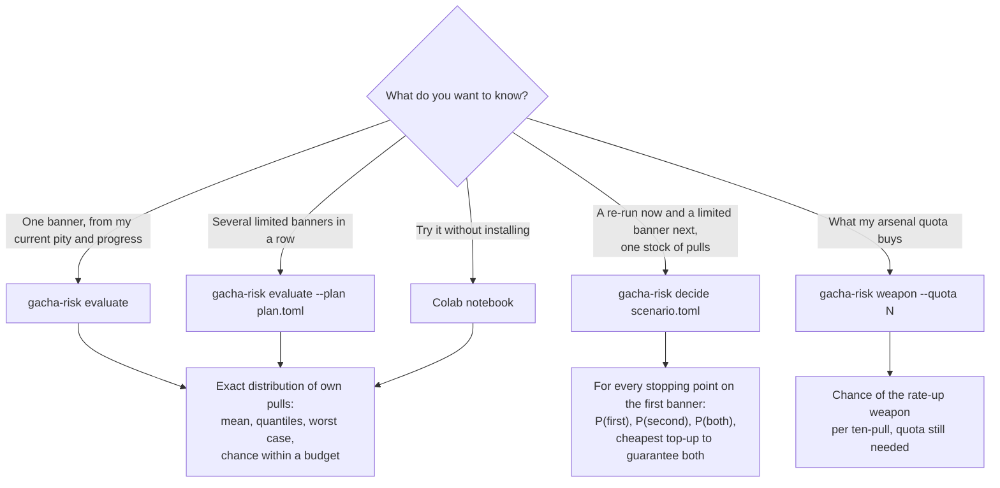
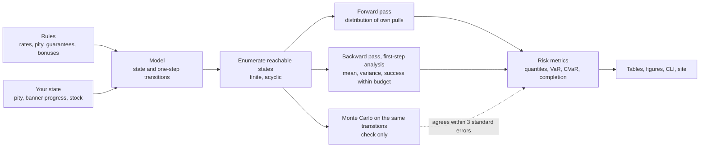

# gacha-risk

[](https://isongzhe.github.io/arknights-endfield-gacha/)
[](https://colab.research.google.com/github/Isongzhe/arknights-endfield-gacha/blob/main/examples/demo.ipynb)
[](https://github.com/Isongzhe/arknights-endfield-gacha/actions/workflows/ci.yml)
[](LICENSE)


Exact waiting-time and budget-risk models for gacha banners, starting with
*Arknights: Endfield* (明日方舟：終末地).

Most gacha advice gives one number, the expected pulls. This project computes the **whole
distribution** from your **current state**, by finite recursion rather than simulation, and uses
it to answer planning questions: how likely is my stock to be enough, where should I stop on
this banner, and what does pulling here cost my chances on the next one.

[繁體中文說明](#繁體中文) · [Rules and assumptions](docs/assumptions.md) · [Architecture](ARCHITECTURE.md) · [Roadmap](ROADMAP.md) · [Documentation index](docs/README.md)

## What it does

- **Exact distributions.** A banner is a finite absorbing Markov chain. The engine enumerates its
  states and returns the probability of finishing in exactly *j* of your own pulls, plus mean,
  variance, quantiles, VaR/CVaR, completion probability and expected shortfall.
- **State-aware.** Start from any pity counter and banner progress, not from a fresh account.
- **Free pulls handled properly.** Banner-bound free pulls advance pity and milestones but cost
  nothing, so every result is in pulls from your own stock.
- **Multi-banner plans.** Pity that carries between banners makes consecutive banners dependent;
  the plan model composes them exactly instead of assuming independence.
- **Two banners, one stock.** For banners with separate pity (a re-run and a limited banner) it
  tabulates every stopping point on the first banner against the chance of getting both targets.
- **Weapons.** The weapon banner in ten-pull issues, and the arsenal quota that character pulls
  bring in.
- **Money.** A price menu turns a shortfall in pulls into the cheapest top-up.
- **Checked three ways.** The engine reproduces the published numbers of the reference paper,
  matches the game's official comprehensive rates to four decimals, and agrees with Monte Carlo
  within three standard errors.

## At a glance

Which entry point answers which question:



How a result is computed:



## The recurring decision

Endfield's schedule so far puts a re-run banner in the second half of each major version and a
new limited character at the start of the next one. Their pity counters are separate, so the
two banners compete only for your stock of pulls. That makes "how far do I go on the re-run
without hurting the next limited character" a question that comes back every version, and it is
what `gacha-risk decide` and the site's calculator are built for.

## Install

Requires Python 3.12+ and [uv](https://docs.astral.sh/uv/).

```bash
git clone https://github.com/Isongzhe/arknights-endfield-gacha.git
cd arknights-endfield-gacha
uv sync
uv run pytest
```

## Use

**One banner, from your current state**

```bash
uv run gacha-risk evaluate --pity 40 --banner-pulls 20 --budget 60
```

**Two banners sharing one stock** — describe your situation in a TOML file
([example](examples/rerun_then_limited.toml)):

```bash
uv run gacha-risk decide examples/rerun_then_limited.toml
```

```text
stock: 89 pulls (78 now + 11 expected)
first banner (rerun): guaranteed within 90 pulls
second banner (limited): guaranteed within 110 own pulls

cap on first   P(first)  P(second)  P(both)
           0     0.0%     78.2%     0.0%
          40    38.0%     59.9%    23.4%
          50    54.8%     59.0%    33.2%
          60    58.3%     58.2%    35.1%
          89    64.7%     38.5%    37.1%

to guarantee both: 200 pulls, 111 more than the stock
worst-case top-up (standard price list): NT$6,120
```

**Weapon banner** — what an amount of arsenal quota buys: `uv run gacha-risk weapon --quota 43940`.

**A sequence of limited banners** with carried pity: `uv run gacha-risk evaluate --plan plan.toml`
(schema in `uv run gacha-risk evaluate --help`).

**From Python**

```python
from gacharisk.kernel.chain import EnumeratedChain
from gacharisk.kernel.forward import hitting_time
from gacharisk.models.endfield import BannerState, SingleBannerModel
from gacharisk.risk import metrics as rk
from gacharisk.rules.endfield import BannerSpec, EndfieldCharacterRules

model = SingleBannerModel(
    BannerSpec(EndfieldCharacterRules(), target_copies=1, cap=120),
    start=BannerState(t=40, n=20, c=0, u=0),
)
dist = hitting_time(EnumeratedChain.from_model(model))
print(rk.mean(dist), rk.quantile(dist, 0.9), rk.completion(dist, 60))
```

**In a notebook, nothing to install**

[](https://colab.research.google.com/github/Isongzhe/arknights-endfield-gacha/blob/main/examples/demo.ipynb)

The notebook text is in Traditional Chinese. Change the numbers marked 改這裡 and rerun the cell.

**Reproduce every table and figure**: `uv run gacha-risk experiment all` writes to `results/`.

The calculator site is published at <https://isongzhe.github.io/arknights-endfield-gacha/> (re-run
plus next limited banner, three consecutive limited banners with skip patterns, weapons, and a
report generated from your inputs). Its source lives in `docs/site/`; build it with
`uv run python docs/site/build.py` and open `docs/site/standalone.html` (built pages are not
committed; `docs/site/fetch_icons.py` optionally downloads operator icons for the checklist).

## How it works

| Layer | Module | Role |
|---|---|---|
| Rules | `gacharisk.rules` | Rates, pity, guarantees and bonuses as plain parameters |
| Models | `gacharisk.models` | State and one-step transitions for a banner or a plan |
| Kernel | `gacharisk.kernel` | State enumeration, forward distribution, backward expectations |
| Risk | `gacharisk.risk` | Quantiles, VaR/CVaR, completion, expected shortfall |
| Analysis | `gacharisk.analysis`, `gacharisk.cost` | Stopping tables and cheapest top-ups |
| Check | `gacharisk.mc` | Monte Carlo that samples the same transitions |

Rules are written once. The exact engine and the simulator both read the same transition
function, so they cannot drift apart. The mathematics is summarised in
[docs/research-notes.md](docs/research-notes.md) and in the site's theory section.

## Scope and limits

- Covers Endfield limited character banners, re-run banners and the first rate-up copy on the
  weapon banner. The 保障配額 rebate is an expected-value approximation; 集成配額 is not modelled.
- Every rule and its source is listed in [docs/assumptions.md](docs/assumptions.md). A few are
  still assumptions; results change if they are wrong.
- Dates, banner schedule and prices are for the Asia server (UTC+8).
- The price menu is the Taiwan list without first-purchase bonuses. Prices are data: check them
  against your own store.
- A model tells you the odds. It does not improve them, and it cannot tell you what a character
  is worth to you.

## Background

The approach extends Hou, Zhu and Zhang, *State-Dependent Asymmetry in Soft-Pity Gacha
Waiting-Time Models: Exact Recurrences, Tail Risk, and Featured-Target Extensions*, Symmetry
2026, 18(6), 1051, [doi:10.3390/sym18061051](https://doi.org/10.3390/sym18061051). That paper
treats one pity counter and lists carry-over between banners, budget-dependent stopping and
currency conversion as future work; those are what this project adds.

## Citing

See [CITATION.cff](CITATION.cff); GitHub shows it under "Cite this repository". The underlying
problems, with their status and references, are listed in
[docs/theory-problems.md](docs/theory-problems.md).

## Disclaimer

This is an unofficial fan and research project. It is not affiliated with or endorsed by
Hypergryph or Gryphline. Game names and terms belong to their owners. Nothing here is financial
advice; gacha spending carries real cost, so set a limit before you pull.

## License

MIT, see [LICENSE](LICENSE).

## 繁體中文

**直接使用**：<https://isongzhe.github.io/arknights-endfield-gacha/>，打開就是試算器，不用安裝。

這是一套抽卡機率的精確計算工具，目前支援《明日方舟：終末地》的限定角色池與復刻池。

- **給完整分布**，不只給期望值：你可以看到中位數、最壞情況、指定抽數內拿到的機率。
- **從你現在的狀態算**：保底計數、池內已抽幾抽、手上有多少抽。
- **回答停損問題**：兩個池共用資源時，第一個池該抽到哪裡停，會讓第二個池的機率掉多少。
- **換算成錢**：差的抽數最便宜要花多少。

不想安裝的話，點下面的按鈕在 Colab 開啟示範筆記，改幾個數字就能算自己的情況。

[](https://colab.research.google.com/github/Isongzhe/arknights-endfield-gacha/blob/main/examples/demo.ipynb)

把你的狀況寫成一個檔案（範例見 [examples/rerun_then_limited.toml](examples/rerun_then_limited.toml)），然後執行：

```bash
uv run gacha-risk decide examples/rerun_then_limited.toml
```

武器池用 `uv run gacha-risk weapon --quota <武庫配額>`。

規則與來源列在 [docs/assumptions.md](docs/assumptions.md)，復刻池、武器池、卡池排程、角色名單與價目在 [docs/rules/](docs/rules/)。
本專案為非官方的研究與同好作品，與鷹角網路、Gryphline 無關。請在抽卡前先決定自己的花費上限。
